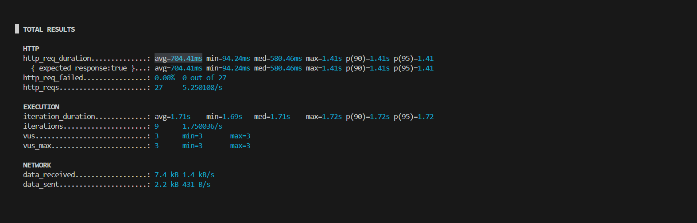
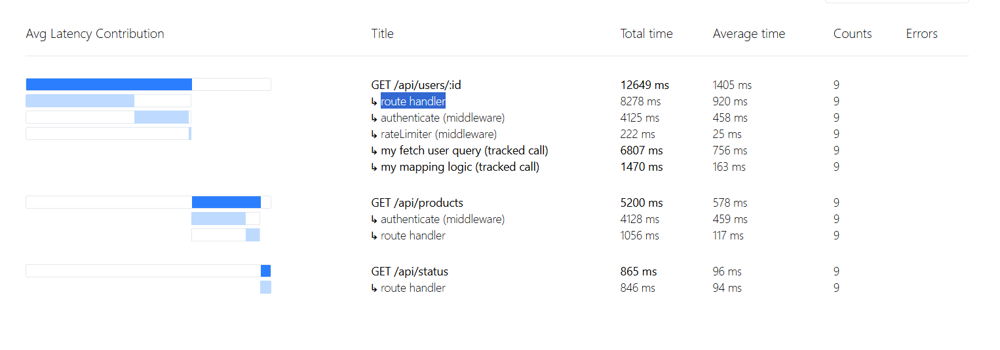

# express-k6-profiler

K6 testing helped me see that my backend's latency was high, but it didn't tell me _why_.

This package shows exactly where the time is being spent in each part of your Express app.


_k6 shows you average latency is 704ms..._


_...and this tells you it's because the route of GET /api/users/:id is slow. You found your bottleneck!_

## Get Started

Install the package:

```bash
npm install express-k6-profiler
```

Import and inject it right at the top of your Express setup:

```javascript
const express = require('express');
const { profile } = require('express-k6-profiler');

const app = express();
profile(app);//<- here

// ... the rest of your app
app.get('/hello', (req, res) => {
  res.send('Hello World');
});

app.listen(3000, () => console.log('App is running'));
```

1. Deploy or start your app on your testing environment (e.g., staging). 
2. Execute your load tests: `k6 run your_tests.js`.
3. Open `your-backend.com/__profile` in your browser to see the breakdown.

_(If you want to avoid route collisions, you can add a prefix: `profile(app, { prefix: '/your/secret/path' })`). Open `your-backend.com/your/secret/path/__profile`_

## Tracking DB Queries etc.

The profiler catches all Express routes and middlewares automatically, but you can also isolate slow database queries or heavy logic using the `track` function:

```javascript
const { track } = require('express-k6-profiler');

app.get('/api/users/:id', async (req, res) => {
  // wrap your database queries like this
  const user = await track('my get user query', () => User.findById(req.params.id));
  
  await track('my mapping logic', async () => {
    // a 50ms blocking work here
  });

  res.json({ user });
});
```
These custom trackers will seamlessly fall into the parent request's timeline tree on the dashboard.

## Alpha Warning + The "Unfair Advantage" 

This project is in alpha! Issues are expected and highly welcome.

Because tracking router layers adds slight performance overhead, **remove this code in production for now.** It's built strictly for local and staging load-testing.

Star the repo or submit issues! I'm actively molding this, and early adopters enjoy an unfair advantage in shaping the roadmap.
